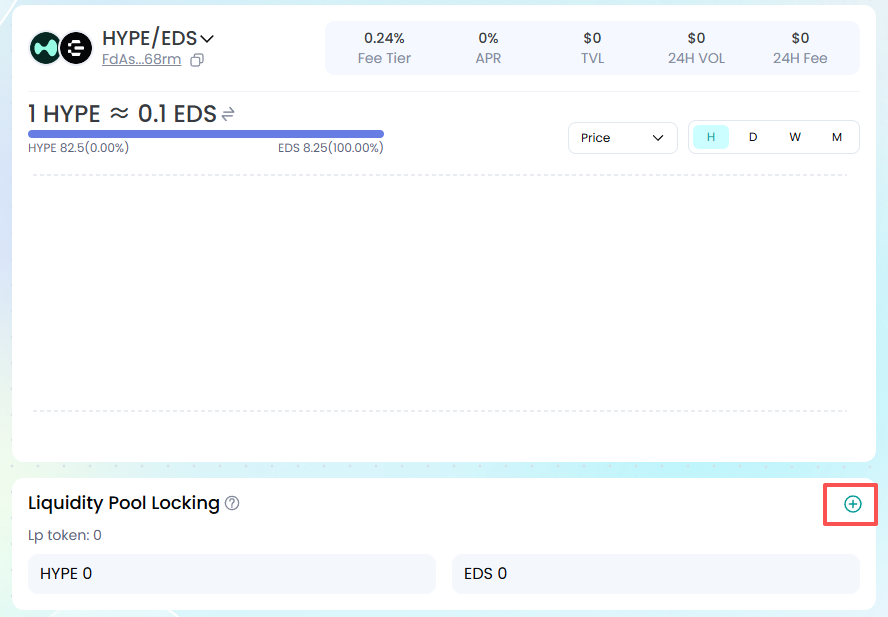
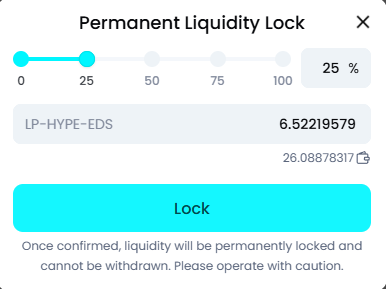
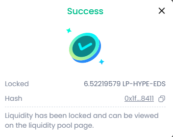

**How to lock liquidity?**

Locking liquidity in a liquidity pool helps increase its social recognition and trust among the broader WEB3 user base. It also ensures the pool's stability and security, preventing malicious attacks.

Once liquidity tokens are locked, the corresponding tokens in the pool are also locked and cannot be withdrawn permanently. However, regular users can still swap the liquidity, and the locked liquidity will follow the pool's reward rules, receiving a share of the fees accordingly.

Connect your wallet and find the "Lock Liquidity" button on the Pool page.

Enter the amount of liquidity tokens to lock, or select the proportion of liquidity tokens you want to lock.

Click \[Lock\], sign in your wallet, and complete the lock successfully.

You can view the currently locked token amount in the liquidity pool on the page.
