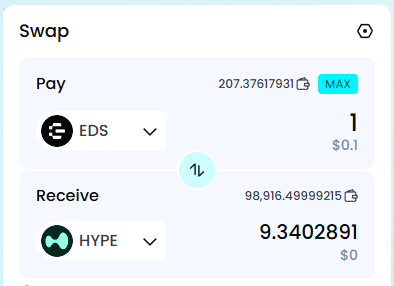
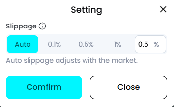

**How to set slippage?**

Because trades are happening in the liquidity pool in real time, token prices and amounts can change. Setting an appropriate slippage in Swap can help increase your transaction success rate.

Click the **\[Settings\]** icon to enter the slippage settings.

Slippage options:

**Auto Slippage**: Dynamically adjusts based on the market and recent trades.

**Manual Slippage**: You can manually select or enter your preferred slippage according to your trading preference.

Transactions will be executed according to the slippage you set.
