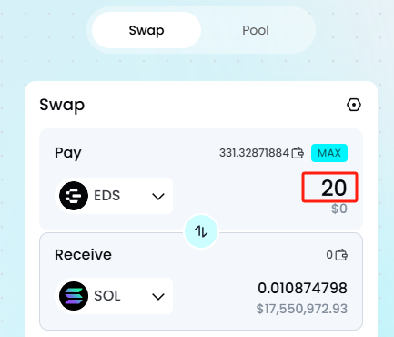
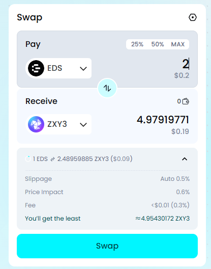

**How to use Instant Exchange**

In a DEX, you can use the Instant Exchange feature to quickly swap tokens anytime, anywhere.

Connect your Web3 wallet.

Select the token you want to \'pay\' with.

  --------------------------------------------------------------------------------------------------------------------------- ----------------------------------------------------------------------------------------------------------------
     
  --------------------------------------------------------------------------------------------------------------------------- ----------------------------------------------------------------------------------------------------------------

Select the token you want to \'receive\'.

Enter the \[amount\] of the token you want to pay.

Confirm the \[amount\] of the token you will receive.

Click \[Swap\] to proceed with the exchange and go to your wallet to sign and authorize.

Transaction completed. You can click \[Details\] to view the details on the blockchain explorer.

