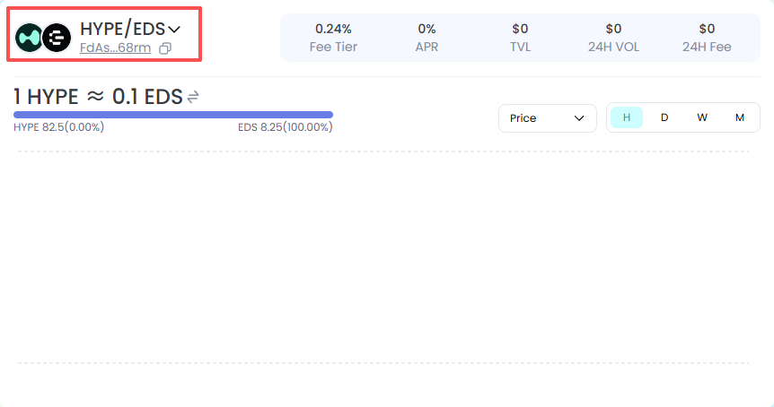
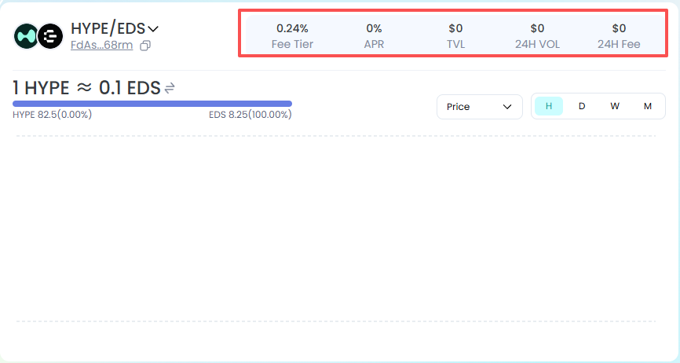
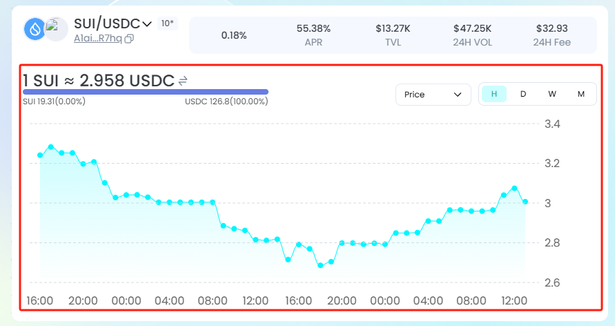

**Quickly understand the charts.**

Understanding liquidity pool charts helps you quickly grasp market trends.

Basic Information of the Liquidity Pool

Logos and names of the two tokens

Liquidity pool address

Data Information

**Fee Rate**: The percentage of fees charged by the current liquidity pool.

**APR**: The annual percentage rate of the pool, estimated based on the past 7 days.

**TVL (Total Value Locked)**: The total value of tokens currently in the liquidity pool.

**24H Volume**: The total trading volume of the liquidity pool in the past 24 hours.

**24H Fee**: The total transaction fees earned by the liquidity pool in the past 24 hours.

Chart Area

**Price Rate**: A token = XXX B tokens, the exchange rate of A token to B token.

**Proportion**: The value proportion of the two tokens in the liquidity pool, along with their respective amounts.

The chart allows you to view the relative price of the two tokens, as well as the trend of the total trading volume.

