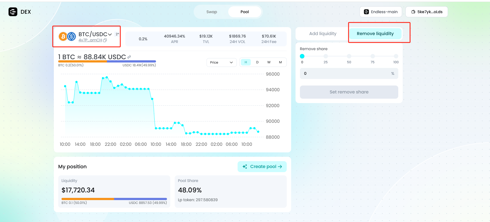
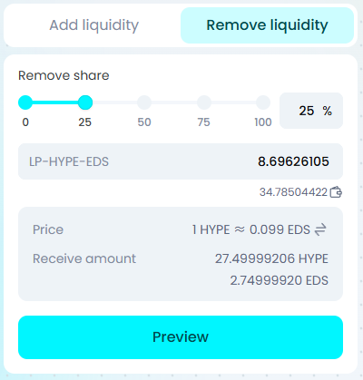
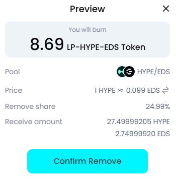
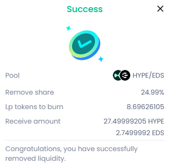

**Remove liquidity**

Connect your Web3 wallet.

Select the \[liquidity pool\] you want to interact with and click Remove liquidity.

Select or enter the proportion of liquidity you want to remove.

Note: Removing liquidity will be done according to the current ratio of the two tokens in the liquidity pool.

Click \[Preview\] to review your removal details, and confirm the amount of LP tokens to be burned and the tokens you will receive.

Click \[Confirm remove\] and go to your wallet to sign and authorize.

Removal successful. You can check your asset status in \[My position\].

