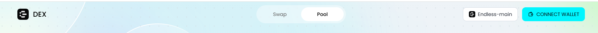
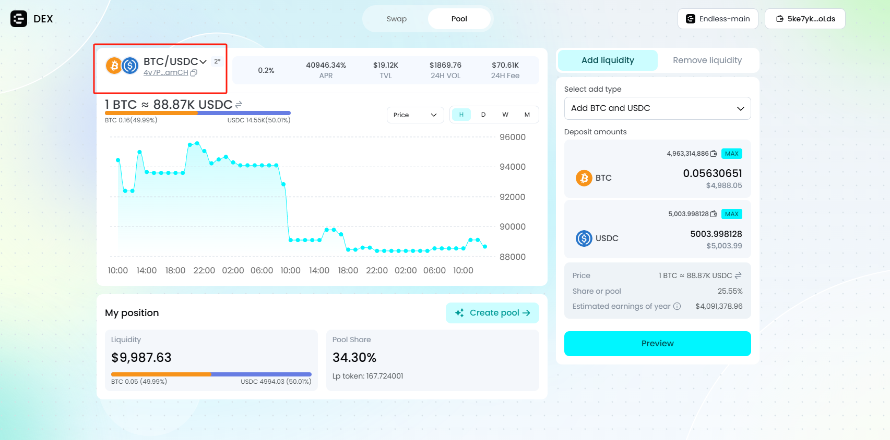
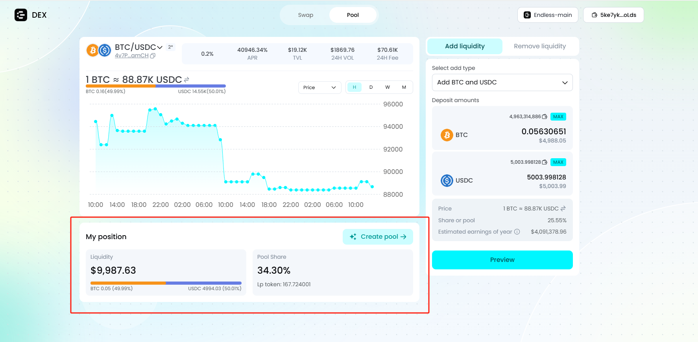
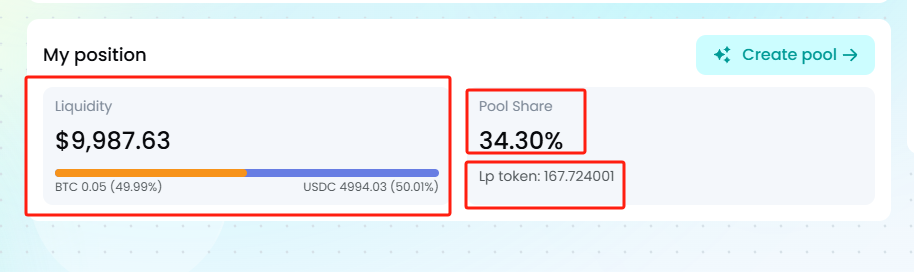

**Understand your assets**

Stay on top of your asset status and adjust according to the market.

Connect your Web3 wallet.

Navigate to the \[Pool\] page.

Select the corresponding \[liquidity pool\].

Locate the \[My position\] section on the page.

Check your assets:

**Liquidity**: Represents the total value of your liquidity in the current pool.\
Below, you can see the proportion of the two token prices in the liquidity and their respective amounts.

**Pool Share**: Represents the percentage of liquidity you own in the current pool.

**LP Token**: The amount of LP tokens held by your connected address.

